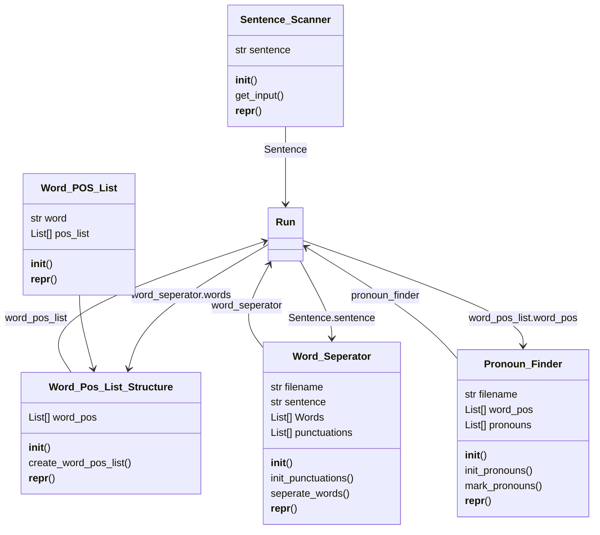

## All details workflow of this project:

```mermaid
classDiagram
	class Sentence_Scanner {
		str sentence
		__init__ ()
		get_input ()
		__repr__ ()
	}
	class Word_Seperator {
		str filename
		str sentence
		List[] Words
		List[] punctuations
		__init__ ()
		init_punctuations ()
		seperate_words ()
		__repr__ ()
	}
	class Word_POS_List {
		str word
		List[] pos_list
		__init__ ()
		__repr__ ()
	}
	class Word_Pos_List_Structure {
		List[] word_pos
		__init__ ()
		create_word_pos_list ()
		__repr__ ()
	}
	class Pronoun_Finder {
		str filename
		List[] word_pos
		List[] pronouns
		__init__ ()
		init_pronouns ()
		mark_pronouns ()
		__repr__ ()
	}
	Sentence_Scanner --> Run : Sentence
	Run --> Word_Seperator : Sentence.sentence
	Word_Seperator --> Run : word_seperator
	Run --> Word_Pos_List_Structure : word_seperator.words
	Word_POS_List --> Word_Pos_List_Structure
	Word_Pos_List_Structure --> Run : word_pos_list
	Run --> Pronoun_Finder : word_pos_list.word_pos
	Pronoun_Finder --> Run : pronoun_finder
```
