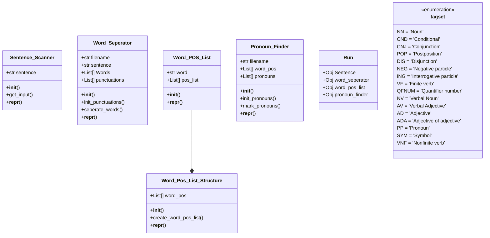

## All details workflow of this project:

### Class Details

```mermaid
classDiagram
	class Sentence_Scanner {
		+str sentence
		+__init__ ()
		+get_input ()
		+__repr__ ()
	}
	class Word_Seperator {
		+str filename
		+str sentence
		+List[] Words
		+List[] punctuations
		+__init__ ()
		+init_punctuations ()
		+seperate_words ()
		+__repr__ ()
	}
	class Word_POS_List {
		+str word
		+List[] pos_list
		+__init__ ()
		+__repr__ ()
	}
	class Word_Pos_List_Structure {
		+List[] word_pos
		+__init__ ()
		+create_word_pos_list ()
		+__repr__ ()
	}
	class Pronoun_Finder {
		+str filename
		+List[] word_pos
		+List[] pronouns
		+__init__ ()
		+init_pronouns ()
		+mark_pronouns ()
		+__repr__ ()
	}

	Word_POS_List --* Word_Pos_List_Structure

	class Run {
		+Obj Sentence
		+Obj word_seperator
		+Obj word_pos_list
		+Obj pronoun_finder
	}

    class tagset {
        <<enumeration>>
        NN = 'Noun'
        CND = 'Conditional'
        CNJ = 'Conjunction'
        POP = 'Postposition'
        DIS = 'Disjunction'
        NEG = 'Negative particle'
        ING = 'Interrogative particle'
        VF = 'Finite verb'
        QFNUM = 'Quantifier number'
        NV = 'Verbal Noun'
        AV = 'Verbal Adjective'
        AD = 'Adjective'
        ADA = 'Adjective of adjective'
        PP = 'Pronoun'
        SYM = 'Symbol'
        VNF = 'Nonfinite verb'
    }
```

### FlowChar for the Project
